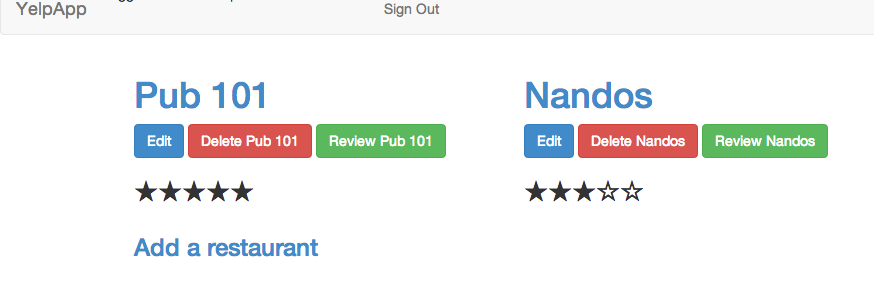

YelpClone
=========

This was my first Rails project. Users can sign up, add their favourite restaurants and review them.

I used the Devise gem for authentication.

It was also my first time using Bootstrap; I think I'm already hooked :)

Eventually I would like to add the Geocoder gem in order to add Maps functionality. 

Given more time I should also brighten up the colours and design, and add a few nice effects using jQuery.
